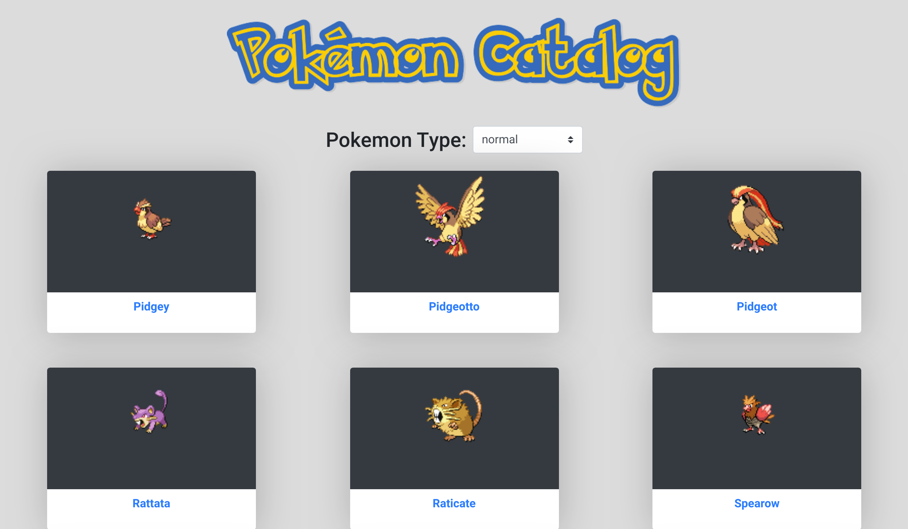

<!-- PROJECT LOGO -->
 

  

  <h3 align="center">React&Redux --> [Pokemon Catalog]</h3>

  

    This project is part of the Microverse curriculum in React module!
     
  

<!-- TABLE OF CONTENTS -->
## Table of Contents

* [About the Project](#about-the-project)
  * [Built With](#built-with)
  * [Usage](#usage)
  * [Automated Test](#automated-test)
* [Contributors](#contributors)
* [Acknowledgements](#acknowledgements)
* [License](#license)

<!-- ABOUT THE PROJECT -->
## About The Project
React capstone based on a catalog of statistics that is a browsable list of items and can be filtered and accessed the details of one item.
The WebApp it has two types of pages, the main one with the list of elements to display and the second one with a single element displaying relevant information about that object. Each page has a unique route within the Single Page Application.
The project retrieves data from an API and stores it in the Redux Store. Based on that API it is possible to filter the data using a Filter stateless component.

###

### Built With
This project was built using these technologies.
* HTML/CSS
* ReactJs
* Redux
* Heroku Buildpack
* npm
* ES6
* Node.js
* ESLint
* StyleLint
* GithubActions :muscle:
* Atom :atom:

* In the project directory, you can run:

  - `$ npm install` - installs all the dependencies required by the project

  - `$ npm start` - runs the app in the development mode:
    - Open [http://localhost:3000](http://localhost:3000) to view it in the browser.
    - The page will reload if you make edits.
    - You will also see any lint errors in the console.

  - `$ npm run build`
    - Builds the app for production to the `build` folder.
    - It correctly bundles React in production mode and optimizes the build for the best performance.
    - The build is minified and the filenames include the hashes.
    - Your app is ready to be deployed!

## Automated Test
  - `$ npm run test` - Launches the test runner in the interactive watch mode, see the section about [running tests](https://facebook.github.io/create-react-app/docs/running-tests) for more information.

 ## Walkthrough Video and Deployment (Heroku)
https://www.loom.com/share/5860127540704697aba0d3dc360b97bd
##

## Live Demo & Deployment
The project has been deployed with [Heroku Buildpack for create-react-app](https://github.com/mars/create-react-app-buildpack#user-content-requires)

[Heroku Live Demo Link](https://react-capstonejsx.herokuapp.com/) :point_left:

